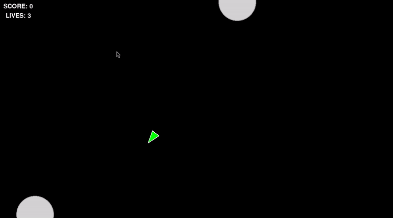

# Arcade

A retro arcade collection built with pygame. Five classic games in a single launcher with a warm CRT aesthetic, persistent high scores, and multiple modes per game.

---

## Games

| Game | Modes |
|---|---|
| Asteroids | Classic, Survival, Hardcore, Zen |
| Snake | Classic, Wrap, Speed Run |
| Tetris | Marathon, Sprint, Ultra |
| Pong | VS Player, VS CPU (Easy / Medium / Hard) |
| Breakout | Classic, Endless |

---

## Running

### Most platforms (Linux, macOS, Windows)

Requires [uv](https://docs.astral.sh/uv/getting-started/installation/):

```bash
uv sync
uv run main.py
```

### Without uv (pip)

Python 3.13+ and pip required:

```bash
python -m venv .venv
source .venv/bin/activate        # Windows: .venv\Scripts\activate
pip install pygame==2.6.1
python main.py
```

### NixOS

I have found on NixOS PyPI pygame wheel can't find zlib because Nix store paths aren't on
`LD_LIBRARY_PATH` by default. `shell.nix` fixes this — it exposes zlib so the wheel
works normally, then `uv run` takes over as usual:

```bash
nix-shell
uv sync
uv run main.py
```

---

## Launcher Controls

| Key | Action |
|---|---|
| Up / Down | Navigate menu |
| Enter | Select |
| Q | Quit |
| Escape | Back one level |
| F3 | Toggle FPS counter |
| F4 | Toggle CRT effects |

---

## In-Game Controls

### Asteroids
| Key | Action |
|---|---|
| W / Up | Thrust forward |
| S / Down | Thrust back |
| A / Left | Rotate left |
| D / Right | Rotate right |
| Space | Shoot |
| Escape / Space | Pause |
| Q | Quit to menu |

### Snake
| Key | Action |
|---|---|
| W / Up | Steer up |
| S / Down | Steer down |
| A / Left | Steer left |
| D / Right | Steer right |
| Escape / Space | Pause |
| Q | Quit to menu |

### Tetris
| Key | Action |
|---|---|
| W / Up | Rotate |
| S / Down | Soft drop |
| A / Left | Move left |
| D / Right | Move right |
| Space | Hard drop |
| C | Hold piece |
| Escape / Space | Pause |
| Q | Quit to menu |

### Pong
| Key | Action |
|---|---|
| W / Up | Left paddle up (all modes) |
| S / Down | Left paddle down (all modes) |
| I | Right paddle up (vs Player only) |
| K | Right paddle down (vs Player only) |
| Escape / Space | Pause |
| Q | Quit to menu |

### Breakout
| Key | Action |
|---|---|
| A / Left | Move paddle left |
| D / Right | Move paddle right |
| Space | Launch ball / pause |
| Q | Quit to menu |
