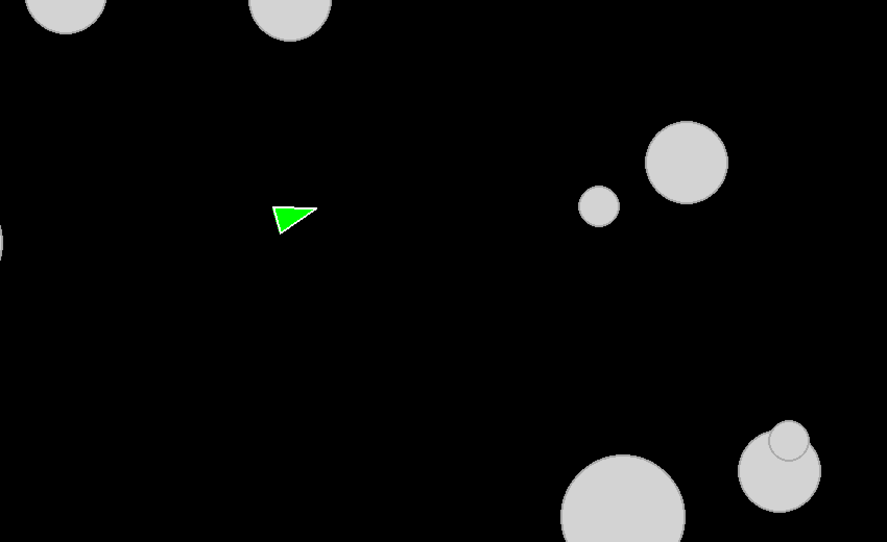

# Asteroids

A pygame implementation of the classic Asteroids arcade game.

## Recent Updates

- **Player Inertia & Acceleration** - Player speeds up and slows down
- **Color Fill** - Visual improvements with filled shapes for all drawables
- **Asteroid Splitting** - Large asteroids split into smaller ones when hit
- **Asteroid Destruction** - Shoot asteroids to destroy them
- **Collision Detection** - Player can collide with asteroids
- **Movement Controls** - Forward/backward thrust and turning

## Running

With uv installed:

```python
uv run main.py
```

## Controls

- W/S - Forward/backward thrust
- A/D - Turn left/right
- Space - Shoot
